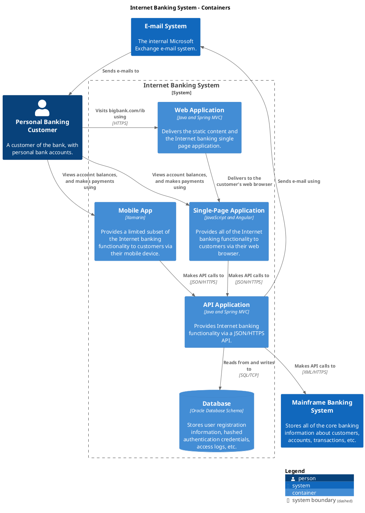

 

```uml
@startuml
' https://plantuml.com/activity-diagram-beta 
[*] -down-> 计划
计划 -right-> 审批: 提交
计划 : 起草一个飞行训练计划，可以反复修改
计划 : 审批不通过的计划同样可以修改，提交审批

审批 -down-> 计划: 通过
审批 : 查看计划内容（同打印的日计划）

审批 -up[#FF0000]-> 计划: 不通过（备注）

计划 -right-> 准备: 通过审批的计划

准备 -right-> 实施
准备 : 飞行员准备...
准备 : 安全员准备...
准备 : 指挥员准备...

准备 -down-> [*]: 取消

实施 -down-> 讲评
实施 : 根据计划表，记录开车、起飞、降落、关车时间
实施 : 临时改变计划 - 包括但不限：机型，时间，人员，转战
实施 : 根据实际情况修改或确认每个人的飞行类型，时间等

讲评 -down-> [*]: 完成
讲评 : 对每个人的飞行情况进行评估。
讲评 : 被评估人对结果进行确认。

@enduml

```

```plant
@startuml
set separator none
title Internet Banking System - System Context

top to bottom direction

!include <C4/C4>
!include <C4/C4_Context>

AddBoundaryTag("Big Bank plc", $borderColor="#cccccc", $fontColor="#cccccc")
Boundary(group_1, "Big Bank plc", $tags="Big Bank plc") {
  System(MainframeBankingSystem, "Mainframe Banking System", "Stores all of the core banking information about customers, accounts, transactions, etc.", $tags="")
  System(EmailSystem, "E-mail System", "The internal Microsoft Exchange e-mail system.", $tags="")
  System(InternetBankingSystem, "Internet Banking System", "Allows customers to view information about their bank accounts, and make payments.", $tags="")
}

Person(PersonalBankingCustomer, "Personal Banking Customer", "A customer of the bank, with personal bank accounts.", $tags="")

Rel_D(PersonalBankingCustomer, InternetBankingSystem, "Views account balances, and makes payments using", $tags="")
Rel_D(InternetBankingSystem, MainframeBankingSystem, "Gets account information from, and makes payments using", $tags="")
Rel_D(InternetBankingSystem, EmailSystem, "Sends e-mail using", $tags="")
Rel_D(EmailSystem, PersonalBankingCustomer, "Sends e-mails to", $tags="")

SHOW_LEGEND(true)
@enduml

```



