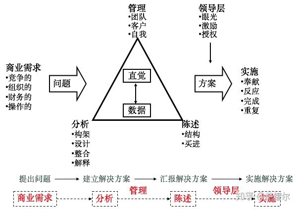
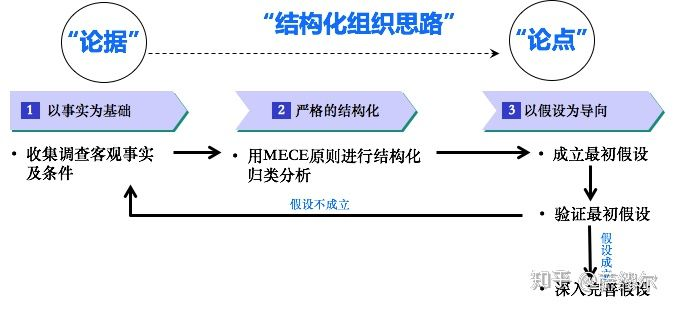
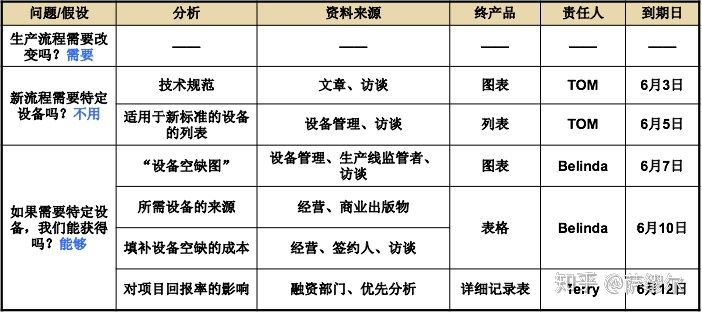
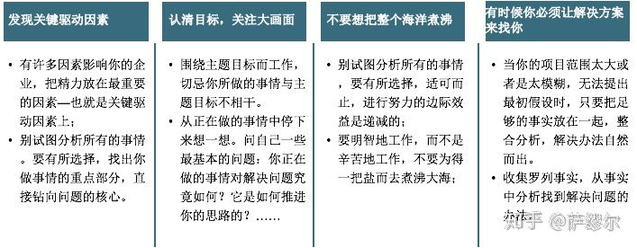

# 麦肯锡意识

这本书主要就介绍了麦肯锡解决问题的模型以及解决问题的流程，下面从两个方面来详细的分享下。

**一、** **麦肯锡解决问题的模型**

- **商业需求**——没有问题（或者更宽泛地说，没有客户需求）也就别谈什么解决问题了。在商业社会中，企业的需求往往来自这几个方面：竞争性的，组织方面的，财务的以及操作上的。
- **分析**——一旦识别了问题，就可以开始着手解决问题了。麦肯锡的“**以事实为依据，以假设为导向**”的问题解决过程是从构建问题开始的：界定问题的边界并将问题细分，这有助于团队提出可行的初始假设。其次是设计和分析：收集必要的数据资料，设计出能够证明或证伪初始假设的分析方案。最后是解释结果：根据分析，证明或证伪初始假设，并为客户提供一套行动方案。
- **陈述**——你或许提出了一个解决方案，但是只有客户了解并接受之后，它才真正具有价值。要达到这个目标，你务必构建“结构化”的陈述报告，以便能清晰、简明地表达你的观点和理念，并确保在场的每一位听众都“买进”你的方案。
- **管理**——为了顺利完成问题的解决这一过程，好的管理（包括几个不同的层次）是不可或缺的！根据问题的需要合理地组建团队，因人而宜，恰如其分地进行人员安排，并在解决问题的过程中，不断地激发和调动团队成员的积极性。时刻与客户保持联系，让客户参与进来 ，形成互动式的交流。
- **实施**——或许你的提案已被接受，但还未付诸实施。这就需要：“奉献”更多的精力，提供更充分的资源；对实施过程中可能出现的一些问题迅速做出反应；跟踪实施全程，确保顺利完成。此外，反复也是必须的，这会有助于你不断地改进工作。反复过程需要对实施效果进行再次评价，并根据评价结果适时做出调整。
- **领导层**——领导层是连结方案和实施的纽带。掌握公司大权的决策者们一定要对公司的发展有一个战略构想（或者说要具备一定的战略眼光）。一定要为那些具体负责实施的人员提供激励机制。一定要从整体出发，通盘考虑，正确授权。

**二、** **麦肯锡解决问题的流程**

使用结构框架建立初始假设，可以让你在最短的时间内选定分析方法、明确研究领域，从而获得一个有说服力的结论。用“结构化”和“假设导向”的方式解决问题，是迈入麦肯锡大门的钥匙。

麦肯锡解决问题的流程如下：

麦肯锡解决问题的流程

**A、** **构建问题：以事实为基础、利用结构化的框架建立初始假设**

麦肯锡解决问题的程序有三个主要特征：

**以事实为基础：**当你要阐述你的观点时，你必需要有足够的事实依据作支撑，说服力更强。

**严格的结构化：**首先界定问题，然后将问题细分。对MECE泰然处之；不要重新发明轮子；每一位客户都是独一无二的。

**以假设为导向**：假设就可以为你和你的团队提供一张解决问题的路线图，它将指引你提出正确的问题，进行正确的分析，从而得到问题的答案。

**B、** **设计分析方法：设计有效的分析方法，使你的团队知道该做什么，如何做，何时完成等问题**

这里所谓的分析设计，就是麦肯锡中的“工作规划”。工作规划通常是负责团队日常运作的项目经理（Engagement Manager,EM）的工作，最终产品是工作计划。一个全面的工作计划总是从建立最初假设过程中的各种问题和子问题开始的。对于每一个问题和子问题，你应该列出以下的内容：

- **关于答案的最初假设**
- **按优先顺序来证明或证伪最初假设的分析方法**
- **实施这种分析所必须的数据**
- **可能的数据来源**
- **对最终产品可能面貌的简要概述**
- **负责最终产品的人员**
- **最终产品的交付日期**

工作规划示例

在这个环节有四个关注点：发现关键驱动因素；要关注大画面；不要想把整个海洋煮沸；有时候你必须让解决方案来找你

最后，关于分析计划的设计方法有4项规则，帮助你缩短决策制定的周期：

- **让假设决定分析方法。**一旦开始设计分析方法，你就必须在直觉和数据之间寻求权衡。直觉和数据是互为补充的，只要综合利用，就能巩固决策的基础。打破这种平衡的关键是质量，而不是数量。集中分析的重要性远远超过了大量分析的重要性。集中分析的另一种方法是杰夫·萨卡古茨推荐的：始终牢记要完成的目标。只要避免不必要的分析，关注于那些容易获胜的方法，你就能在很短的时间内完成大量的工作。（竞争对手分析）
- **理顺分析的优先顺序。**有限条件下解决问题，必将弄清那些分析是绝对必要的，那些是无足轻重的。作为分析设计的第一步，首先要明白不该做什么，即避免干那些与假设无关的分析。第二步，弄清哪些分析是“快速致胜”的。
- **忘却绝对的精确。**保持方向的正确性与精度的合理性。（收益测算、调研数据）
- **确定困难问题的范围。**某些分析方法，即便使你不能完全得到答案，但却缩小了答案的可能范围。

**C、** **数据收集整合：有效的收集数据，在收集过程中实现价值增值**

数据主要来源于访谈、KM、外部采购数据库以及内部数据库及知识管理系统。

在做研究时，麦肯锡不是要尽可能多地获取信息，而是要尽快地获取最重要的信息。把“以数据和事实为导向”的分析方法用于企业，麦肯锡建议，以下三种方式对你的数据收集是很有帮助的：

- **对组织的数据倾向性做出判断。**以事实为基础的文化，要求无论是公司内部员工间的交流，还是与客户的沟通，都必须有事实做支持。惧怕事实已成为有效决策的潜在抑制因素。提高数据收集能力的第一步是：客观地评价公司所处的特定环境。准确地找到公司的主要倾向性。校正所发现的不平衡现象，要特别关注那些能够控制的方面。
- **显示事实的威力。**只要更多地致力于数据收集，你就能产生许多有说服力的见解，而这种说服力恰恰来源于以事实为基础。只要更多地依靠事实，你的分析和建议就一定会更具影响力。
- **构建合适的基础结构。**麦肯锡具有丰富的数据资源。咨询顾问依靠的主要是内部报告、行业报告、分析家报告、统计数据等诸如此类的信息。

**D、** **解释结果：将事实整合成最终产品，形成一份完整的报告书**

麦肯锡建议：陈述报告必须清晰的、令人信服的向客户传达观点和理念。为了达到这一目标，就务必使报告的结构易于理解，麦肯锡强调结构清晰、简单明了。简单来说就是金字塔原理，需要参考一下三原则：

- **结构清晰：**要想使陈述报告取得成功，就必须让听众顺着你的逻辑走。陈述报告应该很清晰的反映出你的思维过程。
- **电梯测验：**或许你没有时间去了解整个案例的所有细节。要想对解决方案有充分的了解，那就是能在30秒内清晰而准确的向客户解释清楚。
- **简单为妙—每个图表只包含一个信息：**图表越复杂，传递信息的效果就越差。

**E、** **阐明理念：提交陈述报告并得到客户的认可**

两条经验：预先打招呼和量体裁衣

**预先打招呼：**

- 主要决策者提及的一些问题常常是你在研究中忽略、但很有可能改变整个结论的关键因素；
- 在大型报告会议之前，事先与客户沟通，讨论有关结论，这会使客户更容易接受你的提案，用“一对一的方式”与客户交流比在正式场合容易得多；
- 若有人对某个建议提出异议，你就可以在正式会议前与他协商，并妥善处理，从而确保在关键时刻他会站在你的一边；
- 预先打招呼开始得越早越好。

**量体裁衣：**

- 要使陈述报告取得成功，那么你就必须了解你的听众，了解他们的背景，他们的偏好，学习他们的语言（他们的思维过程及一些行话）；
- 一个好的框架结构，可以使你根据客户的反映灵活自如地调整陈述报告的内容。千万不要拘泥于报告之中，否则，一旦有情况发生，就很难及时调整

# 麦肯锡思维

# 麦肯锡工具