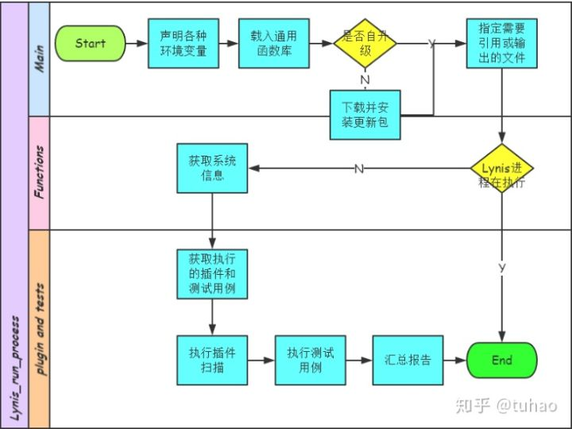
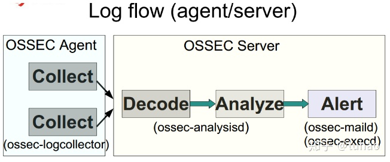
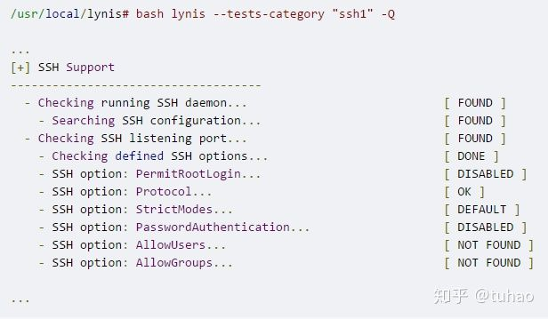
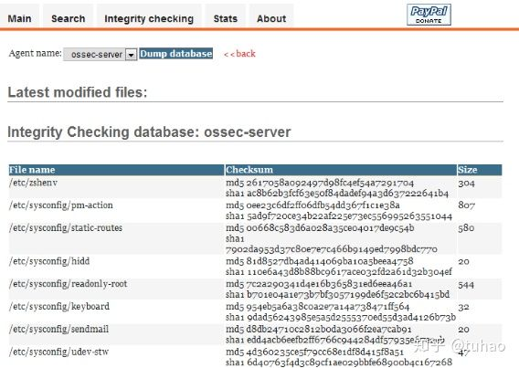
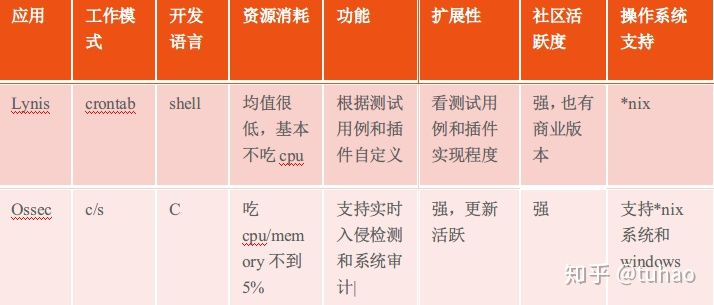
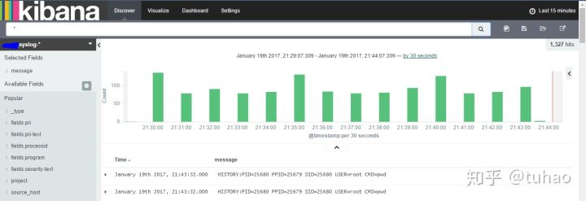
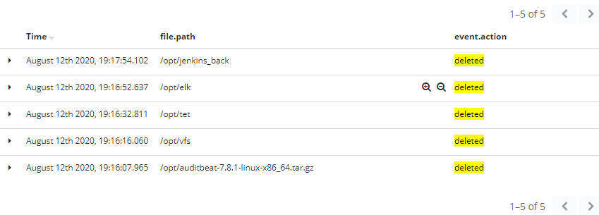
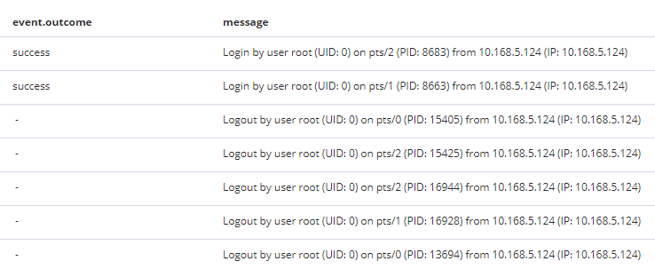
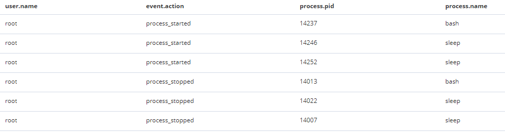
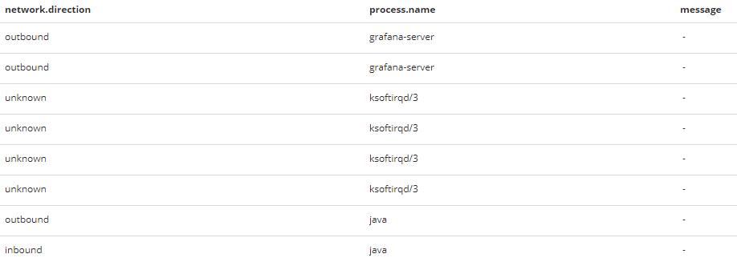

# 前言

## 目的

撰写本文的主要目的是记录调研安全审计方法和技术时，遇到的问题、学习到的知识和自己的思考。为知识积累和技术分享提供资源。

## 背景

公司的业务决定了我们有很多软件数据资产直接暴露给客户，包括我们的友商，需要有一种方法或措施保护我司的软件数字资产和知识产权。但因为公司的运维部门缺少人力，由技术管理中心进行服务器安全审计工作的研究。

# 安全审计

## 什么叫安全审计

为加强公司软件数字资产和知识产权保护、保护公司的技术安全和利益，我们需要利用全面的、自动的、高效的安全技术监控服务器的各种行为和数据，防范机器安全、操作安全、网络安全、数据安全，程度安全。

 为了保障服务器系统资源能被用户正常使用，避免被恶意行为劫持，我们需要记录服务器系统资源的使用情况、系统行为事件信息和I/O流量等信息，为服务器系统的运维和安全保障工作提供可靠的数据支撑。

这里的“审计”，并非一种亡羊补牢式的补救，而是融合了威胁发现、威胁分析和威胁消除的“三位一体”的安全防御体系。 

## 为什么需要安全审计

涉及安全入侵，安全防御应该属于全程联动、环环相扣的，所以对于服务器的安全检测与阻断，需要有一套统一的安全审计系统。我们需要培养全员安全意识，全员责任意识。在服务器上要派驻自己的“哨兵”，实时了解服务器安全风险状态。它不同于其他的运维监控agent，而是“专岗专用”，专门做安全监控，在性能消耗、功能、实现方式上都会有别于传统的运维监控。

## 安全审计系统的组成

一套合格的安全审计系统，应当至少包括以下几个组件：

### 采集器Collector

以客户端Client的方式部署，需要考虑客户端是Pull还是Push的方式，使用crontab还daemon方式运行。采集器要求高性能、高可用，在海量日志面前，采集器的性能是重中之重，一旦发现数据丢失，或者高时延，后面的数据越积越多，“木桶效应”会极其明显。

### 数据存储Storage

海量数据存储，存储容量要大，IO性能要高。

### 数据分析analyzer

数据分析这部分，最主要的还是常见报表输出，比如可以针对服务器信息进行统计，输出一份整体分析表格，方便决策。

### 任务调度Scheduler

这么多组件上的任务调度以及配置推送，需要有一个“大脑”进行管理。当然，每个组件本身也可能是一套子系统，它也有自己的调度层，这两者没有冲突，反而使系统具备层次性，降低了系统耦合度。

为了方便后面我们介绍如何实现安全审计系统，下面提供一个安全审计系统的简单架构图。

## 主要完成以下功能

安全审计至少应该包含：服务器基本信息收集、 系统操作日志收集、 用户访问控制检查、 漏洞本地检测、 异常流量发现、 重要文件操作检测等。并对不同服务采集的数据进行统一的格式化、清理，统一的存储、索引，产生统一的报告、分析，提供统一的接口查询。

# 技术选型

##  常用日志审计解决方案

所谓日志审计，就是记录所有系统及相关用户行为的信息，并且可以自动分析，处理，展示（包括文本或着录像）

1. 通过环境变量命令及syslog服务进行全部日志审计（信息太大，不推荐）
2. sudo配合syslog服务，进行日志审计（信息较少，效果不错，但只有sudo的操作日志）
3. 在bash解释器程序里嵌入一个监视器，让所有被审计的系统用户使用修改过的增加了监视器的特殊bash程序作为解释程序。

##  常用的监控技术

系统行为监控的实现技术主要采用的是以下方法：

### Kprobes调试技术 

 Kprobes调试技术是一种专为Linux内核跟踪和调试而设计的特定API。Kprobes允许内核开发人员为任何内核指令以及函数入口和函数返回处理程序安装预处理程序和后处理程序，这些处理程序可以访问并更改寄存器。这样一来，内核开发者们就可以监控系统调用相关工作流程并簿记。利用Kprobes技术，内核开发人员可以在内核的绝大多数指定函数中动态地插入探测点来收集所需的调试状态信息；关于“调用了哪些系统”、“系统何时被调用”、“执行是否正确以及函数的入参和返回值是什么”等疑惑都可以轻松解决。此外，还能将这些信息屏幕输出或转储日志文件。

### Tracepoints跟踪点技术

内核的tracepoint是一种轻量级的hooks技术，使用高效的系统调用行为跟踪及相关性能计算，对系统本身的性能只有微小的时间损失和空间损失。通过注册syscall_enter_probe等定制的probe函数，在发生系统调用相关行为后，内核找到probe函数，并将参数等信息传递给probe函数。只要将probe函数中记录的相关行为信息输出，即可达到监控目的。

### 结论

这两种技术都涉及到操作系统底层技术，对技术要求比较高，并且没有特别成熟的开源代码可供参考，从头编写工作很大。

## 常用安全审计工具

说起开源安全审计工具，业界最知名的恐怕就是Cisofy主导的Lynis和社区主导的Ossec，两者各有千秋。

### Lynis

*nix系统上使用shell编写的系统安全审计工具

#### 工作原理


#### 安装方式

```text
Debian：apt-get install lynis
```

### Ossec

支持全平台的主机入侵检测系统

#### 工作原理


#### 功能展示


#### 安装方式

```text
Debian:apt-get install ossec-hids/ossec-hids-agent
Windows: ossec-win32/64-agent.exe
```


#### 功能展示


### 功能对比



通过上面的对比，相信大家会发现，论功能和平台兼容性，Ossec优于Lynis，支持Windows上，而且毕竟Ossec是C/S架构，作为HIDS的实时性也会更好。

如果两者一起使用功能可以更加强大，行业中也有对应的结合方案，就是Lynis+ELK和Ossec+ELK，我们可以按平台部署，比如Windows上部署Ossec，Linux上部署Lynis，将数据统一发送到ELK，剩下的实时日志分析、预警就交给ELK来做了。

### 结论

这两个安全审计工具在少数机器安装部署还可以，但根据公司现场多项目，多服务器的情况还需要对安装部署和使用说明进行大量补充


## 简单易用的Auditbeat

Auditbeat是轻量型审计日志采集器，面向RHEL 8、Amazon Linux 2、Ubuntu 18.04 和 Windows Server 2019 等平台崭新。可实时采集服务器审计，然后发送到 Elastic Stack，即可在 Elastic Stack 中监控用户的行为和系统进程，分析用户事件数据。

可以使用既有审计规则来轻而易举地收集数据，而无需重写规则。是谁在什么时间做了什么事情？Auditbeat 会记住所有这些原始的系统调用数据，以及相关联的路径，方便您了解所需的上下文信息。

下面是各种角色说明：
Auditbeat：必选，信息收集
Logstash：可选，数据分析 
ElasticSearch：必选，信息存储，支持实时查询（索引）与api
Kibana：必选，UI用于数据分析和展示
Kafka或Redies：可选，用于处理活动流数据和运营指标数据的消息缓存中间件

### 效果展示



 

# 我们的解决方案

## 自动化安全审计

结合统一日志服务，将服务器的安全审计信息统一采集到统一日志服务中，并通过定制服务器安全审计监控面板，实现实时的统一服务器安全审计功能。

## Auditbeat安装

必须注意选择和自己Elasticsearch想匹配的版本。

```shell
tar -xzvf auditbeat-7.8.1-linux-x86_64.tar.gz -C /opt
mv /opt/auditbeat-7.8.1-linux-x86_64 /opt/auditbeat
cd /opt/auditbeat
ls
```

安装好Auditbeat后的文件显示为：

```
auditbeat  auditbeat.reference.yml  auditbeat.yml  audit.rules.d  data  fields.yml  kibana
```

安装为操作系统服务：

```shell
mkdir logs
rs install auditbeat -p nohup -w /opt/auditbeat/ -l ./logs args ./auditbeat -e &
rs start auditbeat
```


## Auditbeat设置

修改auditbeat.yml中的配置:

vim auditbeat.yml

### 设置 elasticsearch输出

```yml
output.elasticsearch:
  # Array of hosts to connect to.
  hosts: ["10.168.4.14:9200"]

  # Protocol - either `http` (default) or `https`.
  #protocol: "https"

  # Authentication credentials - either API key or username/password.
  #api_key: "id:api_key"
  #username: "elastic"
  #password: "changeme"
```

### 设置Kibana dashboard

以下是设置Kibana dashboard操作，非每个安装都执行。执行前请确保Kibana 已经启动

```yml
setup.dashboards.enabled: true
setup.kibana:
  # IPv6 addresses should always be defined as: https://[2001:db8::1]:5601
  host: "10.168.4.14:5601"
  # Kibana Space ID
  # ID of the Kibana Space into which the dashboards should be loaded. By default,
  # the Default Space will be used.
  #space.id:
```

```shell
auditbeat setup --dashboards
```

### 其它操作

```shell
#查看当前的规则
./auditbeat show auditd-rules 
#测试配置信息
./auditbeat test config -e
#启动测试
./auditbeat -e
```


## 监控的内容

### 文件



### 登录


### 应用的启动关闭



### 应用的网络使用



## 安全审计需要完成的功能

### 定期安全检测报告

定期将服务器审计报告发送给相关人员，让他们保持对服务器安装态势的了解。另外，如果发现了安全风险，也可以让他们一并处理，形成一个良性的互动。

### 检测危险命令报警

### 端口漏洞扫描

### 操作日志分析

### 延伸和扩展

### 构建安全知识库

通过这套系统，我们会发现很多系统、应用级别的漏洞，那么如何高效修复漏洞会是下一个亟待解决的问题。解决方案就是依赖业界经验和企业实战经验构建安全知识库，提供统一的安全基线、安全配置模板以及漏洞修复方案。然后依赖企业自动化运维框架去推送配置、升级系统或者应用。

可以结合公开的安全基线标准去构建自己的安全知识库和配置模板。


 