# redis介绍

##  什么是NoSQL

​     NoSQL，泛指非关系型的数据库，NoSQL即Not-Only SQL，它可以作为关系型数据库的良好补充。随着互联网web2.0网站的兴起，传统的关系数据库在应付web2.0网站，特别是超大规模和高并发的SNS类型的web2.0纯动态网站已经显得力不从心，暴露了很多难以克服的问题，而非关系型的数据库则由于其本身的特点得到了非常迅速的发展。

​     NoSQL数据库的产生就是为了解决大规模数据集合多重数据种类带来的挑战，尤其是大数据应用难题。

 

一些主流的NOSQL产品：


 

 

NoSQL数据库的四大分类如下：

 

n 键值(Key-Value)存储数据库

相关产品： Tokyo Cabinet/Tyrant、Redis、Voldemort、Berkeley DB

典型应用： 内容缓存，主要用于处理大量数据的高访问负载。

数据模型： 一系列键值对

优势： 快速查询

劣势： 存储的数据缺少结构化

 

n 列存储数据库

相关产品：Cassandra, HBase, Riak

典型应用：分布式的文件系统

数据模型：以列簇式存储，将同一列数据存在一起

优势：查找速度快，可扩展性强，更容易进行分布式扩展

 劣势：功能相对局限

n 文档型数据库

相关产品：CouchDB、MongoDB

典型应用：Web应用（与Key-Value类似，Value是结构化的）

数据模型： 一系列键值对

 优势：数据结构要求不严格

 劣势： 查询性能不高，而且缺乏统一的查询语法

n 图形(Graph)数据库

相关数据库：Neo4J、InfoGrid、Infinite Graph

典型应用：社交网络

数据模型：图结构

优势：利用图结构相关算法。

劣势：需要对整个图做计算才能得出结果，不容易做分布式的集群方案。

 

 

## redis历史发展

​     2008年，意大利的一家创业公司Merzia推出了一款基于MySQL的网站实时统计系统LLOOGG，然而没过多久该公司的创始人 Salvatore Sanfilippo便 对MySQL的性能感到失望，于是他决定亲自为LLOOGG量身定做一个数据库，并于2009年开发完成，这个数据库就是Redis。 不过Salvatore Sanfilippo并不满足只将Redis用于LLOOGG这一款产品，而是希望更多的人使用它，于是在同一年Salvatore Sanfilippo将Redis开源发布，并开始和Redis的另一名主要的代码贡献者Pieter Noordhuis一起继续着Redis的开发，直到今天。

​     Salvatore Sanfilippo自己也没有想到，短短的几年时间，Redis就拥有了庞大的用户群体。Hacker News在2012年发布了一份数据库的使用情况调查，结果显示有近12%的公司在使用Redis。国内如新浪微博、街旁网、知乎网，国外如GitHub、Stack Overflow、Flickr等都是Redis的用户。
​     VMware公司从2010年开始赞助Redis的开发， Salvatore Sanfilippo和Pieter Noordhuis也分别在3月和5月加入VMware，全职开发Redis。

 

## 什么是redis

Redis是用C语言开发的一个开源的高性能键值对（key-value）数据库。它通过提供多种键值数据类型来适应不同场景下的存储需求，目前为止Redis支持的键值数据类型如下：

- 字符串类型

- 散列类型

- 列表类型

- 集合类型

- 有序集合类型

 

## 1.4  redis的应用场景

- 缓存（数据查询、短连接、新闻内容、商品内容等等） - 最多使用

- 分布式集群架构中的session分离

- 聊天室的在线好友列表

- 任务队列（秒杀、抢购、12306等等）

- 应用排行榜

- 网站访问统计

- 数据过期处理（可以精确到毫秒）


# 2    安装运行redis

 

## redis安装环境

redis是C语言开发，建议在linux上运行，本教程使用Centos6.5作为安装环境。

安装redis需要先将官网下载的源码进行编译，编译依赖gcc环境，如果没有gcc环境，需要安装gcc：yum install gcc-c++

http://download.redis.io/releases/redis-3.0.0.tar.gz

将redis-3.0.0.tar.gz拷贝到/usr/local下

解压源码

tar -zxvf redis-3.0.0.tar.gz 

进入解压后的目录进行编译

cd /usr/local/redis-3.0.0

make

安装到指定目录,如 /usr/local/redis

cd /usr/local/redis-3.0.0 

make PREFIX=/usr/local/redis install

redis.conf

redis.conf是redis的配置文件，redis.conf在redis源码目录。

注意修改port作为redis进程的端口,port默认6379。

 拷贝配置文件到安装目录下 

 进入源码目录，里面有一份配置文件 redis.conf，然后将其拷贝到安装路径下 

 cd /usr/local/redis

 mkdir conf

 cp /usr/local/redis-3.0.0/redis.conf  /usr/local/redis/bin

 安装目录bin下的文件列表

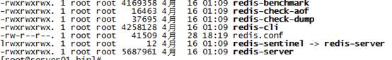

 

 

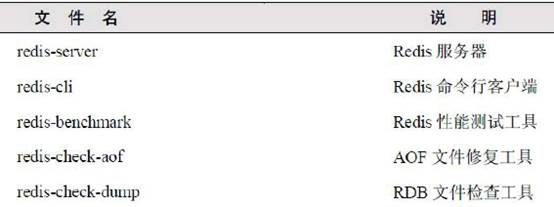

 

redis3.0新增的redis-sentinel是redis集群管理工具可实现高可用。

配置文件目录：

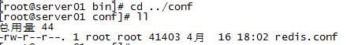

 

## redis启动

### 前端模式启动

​     直接运行bin/redis-server将以前端模式启动，前端模式启动的缺点是ssh命令窗口关闭则redis-server程序结束，不推荐使用此方法。如下图：

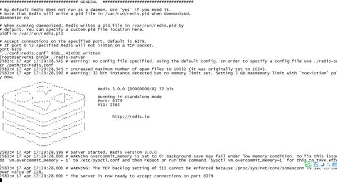

 

 

 

### 后端模式启动

修改redis.conf配置文件， daemonize yes 以后端模式启动。

 

执行如下命令启动redis：

cd /usr/local/redis

./bin/redis-server ./redis.conf

 

redis默认使用6379端口。


也可更改redis.conf文件，修改端口号：

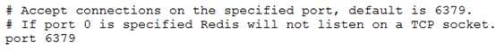

 

### 启动多个redis进程

方法1：

启动时指定端口可在一台服务器启动多个redis进程。

cd /usr/local/redis/bin

./redis-server ./redis.conf --port 6380

 

方法2(推荐此方法)：

创建多个redis目录，以端口号命名，比如：创建6379、6380两个目录，将redis的安装文件bin和conf拷贝至这两个目录。

修改6379目录下的redis.conf设置端口号为6379

修改6380目录下的redis.conf设置端口号为6380

启动6379和6380目录下的redis-server程序：

cd 6379

./redis-server . /redis.conf

cd 6380

./redis-server . /redis.conf

 

 

查询当前redis的进程：

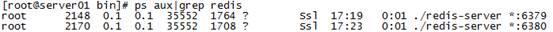

 

## redis停止

强行终止Redis进程可能会导致redis持久化数据丢失。正确停止Redis的方式应该是向Redis发送SHUTDOWN命令，方法为：

 

cd /usr/local/redis

./bin/redis-cli shutdown

 

## redis客户端

​     在redis的安装目录中有redis的客户端，即redis-cli（Redis Command Line Interface），它是Redis自带的基于命令行的Redis客户端。

​     

### 连接redis服务端

执行bin/redis-cli连接redis服务端：

​     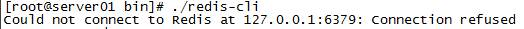

从上图得知redis-cli默认连接本机的redis，本机的redis没有启动则报上图中的错误。

 

指定连接redis服务的ip和端口：

 

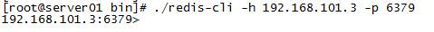

 

### 向redis服务端发送命令

redis-cli连上redis服务后，可以在命令行发送命令。

 

n ping

Redis提供了PING命令来测试客户端与Redis的连接是否正常，如果连接正常会收到回复PONG

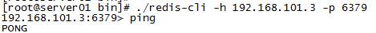

n set/get

 

使用set和get可以向redis设置数据、获取数据。

 

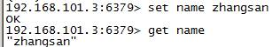

 

## redis多数据库

### redis实例

​     一个redis进程就是一个redis实例，一台服务器可以同时有多个redis实例，不同的redis实例提供不同的服务端口对外提供服务，每个redis实例之间互相影响。每个redis实例都包括自己的数据库，数据库中可以存储自己的数据。

 

### 多数据库测试

​     一个Redis实例可以包括多个数据库，客户端可以指定连接某个redis实例的哪个数据库，就好比一个mysql中创建多个数据库，客户端连接时指定连接哪个数据库。

​     一个redis实例最多可提供16个数据库，下标从0到15，客户端默认连接第0号数据库，也可以通过select选择连接哪个数据库，如下连接1号库：

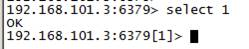

 

在1号库中查询上节设置的数据，结果查询不到：

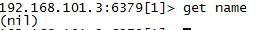

 

重新选择第0号数据库，查询数据：

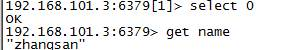

 

如果选择一个不存在数据库则会报错：

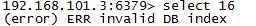

注意：redis不支持修改数据库的名称，只能通过select 0、select 1...选择数据库。

 

 

### 注意问题

在0号数据库存储数据，在1号数据库执行清空数据命令却把0号数据库的数据给清空了：

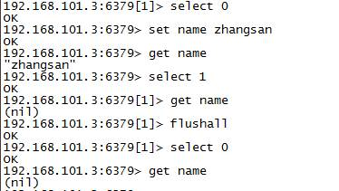

 

**建议：不同的应用系统要使用不同的redis****实例而不是使用同一个redis****实例下的不同数据库。**

 

 

 

# 数据类型--string

## redis string介绍

​     redis中没有使用C语言的字符串表示，而是自定义一个数据结构叫**SDS****（simple dynamic string****）即简单动态字符串**。

打开下载的redis源码包，找到src下的sds.h文件查看sds源码：

 

struct sdshdr {

  //字符串长度

​     unsigned int len;

​     //buf数组中未使用的字节数量

  unsigned int free;

​     //用于保存字符串

  char buf[];

};

​     

​     c语言对字符串的存储是使用字符数组，遇到'\0'字符则认为字符串结束，redis的字符串可以存储任何类型的数据，因为任何类型数据都可以表示成二进制，sds结构中的char buf[]就是存储了二进制数据。

​     redis的字符串是二进制安全的，什么是二进制安全？简单理解就是存入什么数据取出的还是什么数据。redis中的sds不像c语言处理字符串那样遇到'\0'字符则认证字符串结束，它不会对存储进去的二进制数据进行处理，存入什么数据取出还是什么数据。

 

 

## 命令

 

### 赋值与取值

赋值与取值：

*SET key value*

*GET key*

*127.0.0.1:6379> set test 123*

*OK*

*127.0.0.1:6379> get test*

*"123“*

当键不存在时返回空结果。

 

 

### 递增数字

递增数字

*INCR key*

当存储的字符串是整数时，Redis提供了一个实用的命令INCR，其作用是让当前键值递增，并返回递增后的值。

127.0.0.1:6379> incr num

(integer) 1

127.0.0.1:6379> incr num

(integer) 2

127.0.0.1:6379> incr num

(integer) 3 

 

 

### 其它命令

增加制定的整数 

*INCRBY key increment*

示例：

127.0.0.1:6379> incrby num 2

(integer) 5

127.0.0.1:6379> incrby num 2

(integer) 7

127.0.0.1:6379> incrby num 2

(integer) 9 

 

> 减少指定的整数 

*DECR key*

*DECRBY key decrement*

示例：

127.0.0.1:6379> decr num

(integer) 6

127.0.0.1:6379> decr num

(integer) 5

127.0.0.1:6379> decrby num 3

(integer) 2

127.0.0.1:6379> decrby num 3

(integer) -1 

 

> 向尾部追加值 

*APPEND key value*

APPEND的作用是向键值的末尾追加value。如果键不存在则将该键的值设置为value，即相当于 SET key value。返回值是追加后字符串的总长度。

127.0.0.1:6379> set str hello

OK

127.0.0.1:6379> append str " world!"

(integer) 12

127.0.0.1:6379> get str 

"hello world!"

 

 

> 获取字符串长度 

*STRLEN key*

STRLEN命令返回键值的长度，如果键不存在则返回0。 

*127.0.0.1:6379> strle> str* 

*(integer) 0*

*127.0.0.1:6379> set str hello*

*OK*

*127.0.0.1:6379> strlen str* 

*(integer) 5*

 

> 同时设置/获取多个键值 

*MSET key value [key value …]*

*MGET key [key …]*

127.0.0.1:6379> mset k1 v1 k2 v2 k3 v3

OK

127.0.0.1:6379> get k1

"v1"

127.0.0.1:6379> mget k1 k3

1) "v1"

2) "v3"

 

 

 

 

 

# 数据类型--hash

## 4.1  使用string的问题

​     假设有User对象以JSON序列化的形式存储到Redis中，User对象有id，username、password、age、name等属性，存储的过程如下： 

保存、更新：

User对象 à json(string) à redis 

如果在业务上只是更新age属性，其他的属性并不做更新我应该怎么做呢？ 如果仍然采用上边的方法在传输、处理时会造成资源浪费，下边讲的hash可以很好的解决这个问题。

 

## 4.2  redis hash介绍

​     hash叫散列类型，它提供了字段和字段值的映射。字段值只能是字符串类型，不支持散列类型、集合类型等其它类型。如下：

 

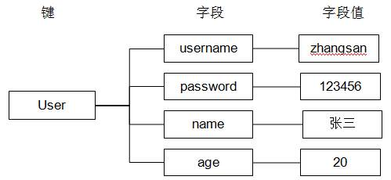

 

 

 

 

## 4.3  命令

### 4.3.1 赋值与取值 

*HSET key field value* *一次只能设置一个字段值*

*HGET key field*          *一次只能获取一个字段值*

*HMSET key field value [field value ...]*       *一次可以设置多个字段值*

*HMGET key field [field ...]*                  *一次可以获取多个字段值*

*HGETALL key*

*127.0.0.1:6379> hset user username zhangsan* 

*(integer) 1*

*127.0.0.1:6379> hget user username*

*"zhangsan“*

HSET命令不区分插入和更新操作，当执行插入操作时HSET命令返回1，当执行更新操作时返回0.

 

*127.0.0.1:6379> hmset user age 20 username lisi* 

*OK*

*127.0.0.1:6379> hmget user age username*

*1) "20"*

*2) "lisi"*

*127.0.0.1:6379> hgetall user*

*1) "age"*

*2) "20"*

*3) "username"*

*4) "lisi"*

 

### 4.3.2 判断字段是否存在

*HEXISTS key field*

*127.0.0.1:6379> hexists user age*       *查看user**中是否有age**字段*

*(integer) 1*

*127.0.0.1:6379> hexists user name* *查看user**中是否有name**字段*

*(integer) 0*

 

*HSETNX key field value*

当**字段**不存在时赋值，类似HSET，区别在于如果字段已经存在，该命令不执行任何操作。

*127.0.0.1:6379> hsetnx user age 30*    *如果user**中没有age**字段则设置age**值为30**，否则不做任何操作*

*(integer) 0*

 

### 4.3.3 增加数字 

*HINCRBY key field increment*

*127.0.0.1:6379> hincrby user age 2*     *将用户的年龄加2*

*(integer) 22*

*127.0.0.1:6379> hget user age*         *获取用户的年龄*

*"22“*

 

 

 

### 4.3.4 其它命令

> 删除字段

**可以删除一个或多个字段，返回值是被删除的字段个数**

*HDEL key field [field ...]*

*127.0.0.1:6379> hdel user age*

*(integer) 1*

*127.0.0.1:6379> hdel user age name*

*(integer) 0*

*127.0.0.1:6379> hdel user age username*

*(integer) 1* 

 

 

> 只获取字段名或字段值 

*HKEYS key*

*HVALS key*

*127.0.0.1:6379> hmset user age 20 name lisi* 

*OK*

*127.0.0.1:6379> hkeys user*

*1) "age"*

*2) "name"*

*127.0.0.1:6379> hvals user*

*1) "20"*

*2) "lisi"*

 

> 获取字段数量 

*HLEN key*

*127.0.0.1:6379> hlen user*

*(integer) 2*

 

 

# 5    数据类型--list

## 5.1  ArrayList与LinkedList的区别

​     ArrayList使用数组方式存储数据，所以根据索引查询数据速度快，而新增或者删除元素时需要设计到位移操作，所以比较慢。

​     LinkedList使用双向链接方式存储数据，每个元素都记录前后元素的指针，所以插入、删除数据时只是更改前后元素的指针指向即可，速度非常快，然后通过下标查询元素时需要从头开始索引，所以比较慢，但是如果查询前几个元素或后几个元素速度比较快。

 

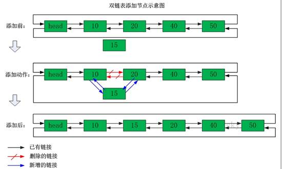

 

 

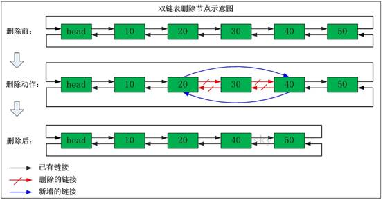

 

## 5.2  redis list介绍

​     列表类型（list）可以存储一个有序的字符串列表，常用的操作是向列表两端添加元素，或者获得列表的某一个片段。

​     列表类型内部是使用双向链表（double linked list）实现的，所以向列表两端添加元素的时间复杂度为0(1)，获取越接近两端的元素速度就越快。这意味着即使是一个有几千万个元素的列表，获取头部或尾部的10条记录也是极快的。

 

 

## 5.3  命令

### 5.3.1 向列表两端增加元素。 

*LPUSH key value [value ...]*

*RPUSH key value [value ...]*

*向列表左边增加元素*

*127.0.0.1:6379> lpush list:1 1 2 3*

*(integer) 3*

*向列表右边增加元素*

*127.0.0.1:6379> rpush list:1 4 5 6*

*(integer) 3*

 

### 5.3.2 从列表两端弹出元素 

*LPOP key*

*RPOP key*

LPOP命令从列表左边弹出一个元素，会分两步完成，第一步是将列表左边的元素从列表中移除，第二步是返回被移除的元素值。

127.0.0.1:6379> lpop list:1

"3“

127.0.0.1:6379> rpop list:1

"6“

 

### 5.3.3 获取列表中元素的个数 

*LLEN key*

*127.0.0.1:6379> llen list:1*

*(integer) 2*

### 5.3.4 获取列表片段 

*LRANGE key start stop*

LRANGE命令是列表类型最常用的命令之一，获取列表中的某一片段，将返回start、stop之间的所有元素（包含两端的元素），索引从0开始。索引可以是负数，如：“-1”代表最后边的一个元素。

*127.0.0.1:6379> lrange list:1 0 2*

*1) "2"*

*2) "1"*

*3) "4"*

 

 

### 5.3.5 其它命令

> 删除列表中指定的值 

*LREM key count value*

LREM命令会删除列表中前count个值为value的元素，返回实际删除的元素个数。根据count值的不同，该命令的执行方式会有所不同：

l 当count>0时， LREM会从列表左边开始删除。 

l 当count<0时， LREM会从列表后边开始删除。 

l 当count=0时， LREM删除所有值为value的元素。 

 

> 获得/设置指定索引的元素值 

LINDEX key index

LSET key index value

127.0.0.1:6379> lindex l:list 2

"1"

127.0.0.1:6379> lset l:list 2 2

OK

127.0.0.1:6379> lrange l:list 0 -1

1) "6"

2) "5"

3) "2"

4) "2"

 

> 只保留列表指定片段，指定范围和LRANGE一致

*LTRIM key start stop*

*127.0.0.1:6379> lrange l:list 0 -1*

*1) "6"*

*2) "5"*

*3) "0"*

*4) "2"*

*127.0.0.1:6379> ltrim l:list 0 2*

*OK*

*127.0.0.1:6379> lrange l:list 0 -1*

*1) "6"*

*2) "5"*

*3) "0"*

 

> 向列表中插入元素 

*LINSERT key BEFORE|AFTER pivot value*

该命令首先会在列表中从左到右查找值为pivot的元素，然后根据第二个参数是BEFORE还是AFTER来决定将value插入到该元素的前面还是后面。

127.0.0.1:6379> lrange list 0 -1

1) "3"

2) "2"

3) "1"

127.0.0.1:6379> linsert list after 3 4

(integer) 4

127.0.0.1:6379> lrange list 0 -1

1) "3"

2) "4"

3) "2"

4) "1"

 

 

> 将元素从一个列表转移到另一个列表中 

*RPOPLPUSH source destination*

*127.0.0.1:6379> rpoplpush list newlist* 

*"1"*

*127.0.0.1:6379> lrange newlist 0 -1*

*1) "1"*

*127.0.0.1:6379> lrange list 0 -1*

*1) "3"*

*2) "4"*

*3) "2"* 

 

 

# 6    数据类型--set

## 6.1  redis set介绍

在集合中的每个元素都是不同的，且没有顺序。

 

集合类型和列表类型的对比：


​     集合类型的常用操作是向集合中加入或删除元素、判断某个元素是否存在等，由于集合类型的Redis内部是使用值为空的散列表实现，所有这些操作的时间复杂度都为0(1)。

Redis还提供了多个集合之间的交集、并集、差集的运算。

## 6.2  命令

### 6.2.1 增加/删除元素 

*SADD key member [member ...]*

*SREM key member [member ...]*

*127.0.0.1:6379> sadd set a b c*

*(integer) 3*

*127.0.0.1:6379> sadd set a*

*(integer) 0*

*127.0.0.1:6379> srem set c d*

*(integer) 1*

 

### 6.2.2 获得集合中的所有元素 

*SMEMBERS key*

127.0.0.1:6379> smembers set

1) "b"

2) "a”

判断元素是否在集合中，无论集合中有多少元素都可以极速的返回结果。

*SISMEMBER key member*

127.0.0.1:6379> sismember set a

(integer) 1

127.0.0.1:6379> sismember set h

(integer) 0

 

## 6.3  其它命令

 

### 6.3.1 集合的差集运算 A-B

属于A并且不属于B的元素构成的集合。


*SDIFF key [key ...]*

*127.0.0.1:6379> sadd setA 1 2 3*

*(integer) 3*

*127.0.0.1:6379> sadd setB 2 3 4*

*(integer) 3*

*127.0.0.1:6379> sdiff setA setB* 

*1) "1"*

*127.0.0.1:6379> sdiff setB setA* 

*1) "4"*

 

### 6.3.2 集合的交集运算 A ∩ B

属于A且属于B的元素构成的集合。


SINTER key [key ...]

127.0.0.1:6379> sinter setA setB 

1) "2"

2) "3"

 

### 6.3.3 集合的并集运算 A ∪ B

属于A或者属于B的元素构成的集合


 

SUNION key [key ...]

*127.0.0.1:6379> sunion setA setB*

*1) "1"*

*2) "2"*

*3) "3"*

*4) "4"*

 

### 6.3.4 其它命令(自学)

> 获得集合中元素的个数 

*SCARD key*

127.0.0.1:6379> smembers setA 

1) "1"

2) "2"

3) "3"

127.0.0.1:6379> scard setA 

(integer) 3

从集合中弹出一个元素

*SPOP key*

*127.0.0.1:6379> spop setA* 

*"1“*

注意：由于集合是无序的，所有SPOP命令会从集合中随机选择一个元素弹出

 

 

 

 

# 7    数据类型--sorted set

## 7.1  redis sorted set介绍

​     在集合类型的基础上有序集合类型为集合中的每个元素都关联一个分数，这使得我们不仅可以完成插入、删除和判断元素是否存在在集合中，还能够获得分数最高或最低的前N个元素、获取指定分数范围内的元素等与分数有关的操作。

在某些方面有序集合和列表类型有些相似。

1、二者都是有序的。 

2、二者都可以获得某一范围的元素。 

但是，二者有着很大区别：

1、列表类型是通过链表实现的，获取靠近两端的数据速度极快，而当元素增多后，访问中间数据的速度会变慢。

2、有序集合类型使用散列表实现，所有即使读取位于中间部分的数据也很快。 

3、列表中不能简单的调整某个元素的位置，但是有序集合可以（通过更改分数实现） 

4、有序集合要比列表类型更耗内存。 

 

## 7.2  命令

### 7.2.1 增加元素

​     向有序集合中加入一个元素和该元素的分数，如果该元素已经存在则会用新的分数替换原有的分数。返回值是**新**加入到集合中的元素个数，不包含之前已经存在的元素。

*ZADD key score member [score member ...]*

*127.0.0.1:6379> zadd scoreboard 80 zhangsan 89 lisi 94 wangwu* 

*(integer) 3*

*127.0.0.1:6379> zadd scoreboard 97 lisi* 

*(integer) 0*

获取元素的分数

ZSCORE key member

127.0.0.1:6379> zscore scoreboard lisi 

"97"

 

### 7.2.2 获得排名在某个范围的元素列表

获得排名在某个范围的元素列表

*ZRANGE key start stop [WITHSCORES]*            照元素分数从小到大的顺序返回索引从start到stop之间的所有元素（包含两端的元素）

 

127.0.0.1:6379> zrange scoreboard 0 2

1) "zhangsan"

2) "wangwu"

3) "lisi“


 

*ZREVRANGE key start stop [WITHSCORES]*        照元素分数从大到小的顺序返回索引从start到stop之间的所有元素（包含两端的元素）

 

127.0.0.1:6379> zrevrange scoreboard 0 2

1) " lisi "

2) "wangwu"

3) " zhangsan “

 

 

如果需要获得元素的分数的可以在命令尾部加上*WITHSCORES**参数*

127.0.0.1:6379> zrange scoreboard 0 1 WITHSCORES

1) "zhangsan"

2) "80"

3) "wangwu"

4) "94"

 

### 7.2.3 获得指定分数范围的元素 

*ZRANGEBYSCORE key min max [WITHSCORES] [LIMIT offset count]*

*127.0.0.1:6379> ZRANGEBYSCORE scoreboard 90 97 WITHSCORES*

*1) "wangwu"*

*2) "94"*

*3) "lisi"*

*4) "97"*

*127.0.0.1:6379> ZRANGEBYSCORE scoreboard 90 (97 WITHSCORES*

*1) "wangwu"*

*2) "94“*

*127.0.0.1:6379> ZRANGEBYSCORE scoreboard 70 100 limit 1 2*

*1) "wangwu"*

*2) "lisi"*

 

### 7.2.4 增加某个元素的分数，返回值是更改后的分数。 

*ZINCRBY key increment member*

给lisi加4分

127.0.0.1:6379> ZINCRBY scoreboard 4 lisi 

"101“

获得集合中元素的数量

*ZCARD key*

127.0.0.1:6379> ZCARD scoreboard

(integer) 3

获得指定分数范围内的元素个数

*ZCOUNT key min max*

*127.0.0.1:6379> ZCOUNT scoreboard 80 90*

*(integer) 1*

 

 

### 7.2.5 其它命令

 

 

> 按照排名范围删除元素 

*ZREMRANGEBYRANK key start stop*

*127.0.0.1:6379> ZREMRANGEBYRANK scoreboard 0 1*

*(integer) 2* 

*127.0.0.1:6379> ZRANGE scoreboard 0 -1*

*1) "lisi"*

*ZREMRANGEBYSCORE key min max*

按照分数范围删除元素

127.0.0.1:6379> zadd scoreboard 84 zhangsan   

(integer) 1

127.0.0.1:6379> ZREMRANGEBYSCORE scoreboard 80 100

(integer) 1

 

> 获取元素的排名 

*ZRANK key member*

*ZREVRANK key member*

从小到大

127.0.0.1:6379> ZRANK scoreboard lisi 

(integer) 0

从大到小

127.0.0.1:6379> ZREVRANK scoreboard zhangsan 

(integer) 1

 

 

# 8    keys命令

## 8.1  设置key的生存时间

Redis在实际使用过程中更多的用作缓存，然而缓存的数据一般都是需要设置生存时间的，即：到期后数据销毁。

 

*EXPIRE key seconds*           *设置key**的生存时间（单位：秒）key**在多少秒后会自动删除*

*TTL key*                     *查看key**生于的生存时间*

*PERSIST key*                 *清除生存时间* 

*PEXPIRE key milliseconds*     *生存时间设置单位为：毫秒* 

 

*例子：*

*192.168.101.3:7002> set test 1*        *设置test**的值为1*

*OK*

*192.168.101.3:7002> get test*          *获取test**的值*

*"1"*

*192.168.101.3:7002> EXPIRE test 5*     *设置test**的生存时间为5**秒*

*(integer) 1*

*192.168.101.3:7002> TTL test*          *查看test**的生于生成时间还有1**秒删除*

*(integer) 1*

*192.168.101.3:7002> TTL test*

*(integer) -2*

*192.168.101.3:7002> get test*          *获取test**的值，已经删除*

*(nil)*

 

## 8.2  其它命令

 

> keys

返回满足给定pattern 的所有key

redis 127.0.0.1:6379> keys mylist*

1) "mylist"

2) "mylist5"

3) "mylist6"

4) "mylist7"

5) "mylist8"

 

> exists

确认一个key 是否存在

redis 127.0.0.1:6379> exists HongWan

(integer) 0

redis 127.0.0.1:6379> exists age

(integer) 1

redis 127.0.0.1:6379>

从结果来数据库中不存在HongWan 这个key，但是age 这个key 是存在的

> del

删除一个key

redis 127.0.0.1:6379> del age

(integer) 1

redis 127.0.0.1:6379> exists age

(integer) 0

redis 127.0.0.1:6379>

从结果来数据库中不存在HongWan 这个key，但是age 这个key 是存在的

 

> rename

重命名key

redis 127.0.0.1:6379[1]> keys *

1) "age"

redis 127.0.0.1:6379[1]> rename age age_new

OK

redis 127.0.0.1:6379[1]> keys *

1) "age_new"

redis 127.0.0.1:6379[1]>

age 成功的被我们改名为age_new 了

 

> type

返回值的类型

redis 127.0.0.1:6379> type addr

string

redis 127.0.0.1:6379> type myzset2

zset

redis 127.0.0.1:6379> type mylist

list

redis 127.0.0.1:6379>

这个方法可以非常简单的判断出值的类型

 

# 9    服务器命令

 

> ping

测试连接是否存活

redis 127.0.0.1:6379> ping

PONG

//执行下面命令之前，我们停止redis 服务器

redis 127.0.0.1:6379> ping

Could not connect to Redis at 127.0.0.1:6379: Connection refused

//执行下面命令之前，我们启动redis 服务器

not connected> ping

PONG

redis 127.0.0.1:6379>

第一个ping 时，说明此连接正常

第二个ping 之前，我们将redis 服务器停止，那么ping 是失败的

第三个ping 之前，我们将redis 服务器启动，那么ping 是成功的

 

> echo

在命令行打印一些内容

redis 127.0.0.1:6379> echo HongWan

"HongWan"

redis 127.0.0.1:6379>

> select

选择数据库。Redis 数据库编号从0~15，我们可以选择任意一个数据库来进行数据的存取。

redis 127.0.0.1:6379> select 1

OK

redis 127.0.0.1:6379[1]> select 16

(error) ERR invalid DB index

redis 127.0.0.1:6379[16]>

当选择16 时，报错，说明没有编号为16 的这个数据库

 

> quit

退出连接。

redis 127.0.0.1:6379> quit

 

> dbsize

返回当前数据库中key 的数目。

redis 127.0.0.1:6379> dbsize

(integer) 18

redis 127.0.0.1:6379>

结果说明此库中有18 个key

> info

获取服务器的信息和统计。

redis 127.0.0.1:6379> info

redis_version:2.2.12

redis_git_sha1:00000000

redis_git_dirty:0

arch_bits:32

multiplexing_api:epoll

process_id:28480

uptime_in_seconds:2515

uptime_in_days:0

。。。。

。。。。

 

> flushdb

删除当前选择数据库中的所有key。

redis 127.0.0.1:6379> dbsize

(integer) 18

redis 127.0.0.1:6379> flushdb

OK

redis 127.0.0.1:6379> dbsize

(integer) 0

redis 127.0.0.1:6379>

在本例中我们将0 号数据库中的key 都清除了。

 

> flushall

删除所有数据库中的所有key。

redis 127.0.0.1:6379[1]> dbsize

(integer) 1

redis 127.0.0.1:6379[1]> select 0

OK

redis 127.0.0.1:6379> flushall

OK

redis 127.0.0.1:6379> select 1

OK

redis 127.0.0.1:6379[1]> dbsize

(integer) 0

redis 127.0.0.1:6379[1]>

在本例中我们先查看了一个1 号数据库中有一个key，然后我切换到0 号库执行flushall 命令，结果1 号库中的key 也被清除了，说是此命令工作正常。

 

 

# 10       持久化

​     Redis的高性能是由于其将所有数据都存储在了内存中，为了使Redis在重启之后仍能保证数据不丢失，需要将数据从内存中同步到硬盘中，这一过程就是持久化。

​     Redis支持两种方式的持久化，一种是RDB方式，一种是AOF方式。可以单独使用其中一种或将二者结合使用。

## 10.1    RDB持久化

​     RDB方式的持久化是通过快照（snapshotting）完成的，当符合一定条件时Redis会自动将内存中的数据进行快照并持久化到硬盘。

​     RDB是Redis默认采用的持久化方式，在redis.conf配置文件中默认有此下配置：

save 900 1

save 300 10

save 60 10000

 

​     save 开头的一行就是持久化配置，可以配置多个条件（每行配置一个条件），每个条件之间是“或”的关系，“save 900 1”表示15分钟（900秒钟）内至少1个键被更改则进行快照，“save 300 10”表示5分钟（300秒）内至少10个键被更改则进行快照。

 

在redis.conf中：

​     配置dir指定rdb快照文件的位置

​     配置dbfilenam指定rdb快照文件的名称

 

 

​     Redis启动后会读取RDB快照文件，将数据从硬盘载入到内存。根据数据量大小与结构和服务器性能不同，这个时间也不同。通常将记录一千万个字符串类型键、大小为1GB的快照文件载入到内存中需要花费20～30秒钟。

 

​     问题总结：

​     通过RDB方式实现持久化，一旦Redis异常退出，就会丢失最后一次快照以后更改的所有数据。这就需要开发者根据具体的应用场合，通过组合设置自动快照条件的方式来将可能发生的数据损失控制在能够接受的范围。如果数据很重要以至于无法承受任何损失，则可以考虑使用AOF方式进行持久化。

 

## 10.2    AOF持久化

​     默认情况下Redis没有开启AOF（append only file）方式的持久化，可以通过appendonly参数开启：

appendonly yes

开启AOF持久化后每执行一条会更改Redis中的数据的命令，Redis就会将该命令写入硬

盘中的AOF文件。AOF文件的保存位置和RDB文件的位置相同，都是通过dir参数设置的，默认的文件名是appendonly.aof，可以通过appendfilename参数修改：appendfilename appendonly.aof

 

 

# 11       主从复制

## 11.1    什么是主从复制

 

​     持久化保证了即使redis服务重启也会丢失数据，因为redis服务重启后会将硬盘上持久化的数据恢复到内存中，但是当redis服务器的硬盘损坏了可能会导致数据丢失，如果通过redis的主从复制机制就可以避免这种单点故障，如下图：

 

 

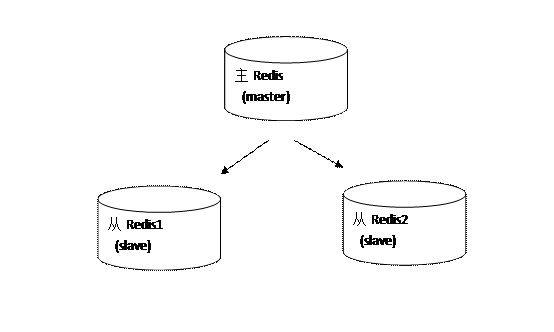


说明：

> 主redis中的数据有两个副本（replication）即从redis1和从redis2，即使一台redis服务器宕机其它两台redis服务也可以继续提供服务。

> 主redis中的数据和从redis上的数据保持实时同步，当主redis写入数据时通过主从复制机制会复制到两个从redis服务上。

> 只有一个主redis，可以有多个从redis。

> 主从复制不会阻塞master，在同步数据时，master 可以继续处理client 请求

> 一个redis可以即是主又是从，如下图：

 

 

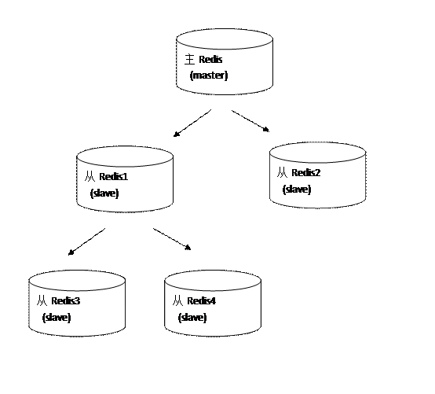

 

 

## 11.2    哨兵模式

### 11.2.1 主redis配置

无需特殊配置。

 

### 11.2.2 从redis配置

修改从redis服务器上的redis.conf文件，添加**slaveof** **主redisip** **主redis****端口**

 

slaveof ip port

slaveof 192.168.0.131 6379

 

上边的配置说明当前该从redis服务器所对应的主redis是192.168.101.3，端口是6379

sentinel.conf配置：

sentinel monitor mymaster 192.168.0.131 6379 1

 

# 12       附

## 12.1    redis.conf配置

Redis 支持很多的参数，但都有默认值。

 daemonize:

默认情况下，redis 不是在后台运行的，如果需要在后台运行，把该项的值更改为yes

 pidfile

当Redis 在后台运行的时候，Redis 默认会把pid 文件放在/var/run/redis.pid，你可以配

置到其他地址。当运行多个redis 服务时，需要指定不同的pid 文件和端口

 bind

指定Redis 只接收来自于该IP 地址的请求，如果不进行设置，那么将处理所有请求，在

生产环境中最好设置该项

 port

监听端口，默认为6379

 timeout

设置客户端连接时的超时时间，单位为秒。当客户端在这段时间内没有发出任何指令，

那么关闭该连接

 loglevel

log 等级分为4 级，debug, verbose, notice, 和warning。生产环境下一般开启notice

 logfile

配置log 文件地址，默认使用标准输出，即打印在命令行终端的窗口上

 databases

设置数据库的个数，可以使用SELECT <dbid>命令来切换数据库。默认使用的数据库是0

 save

设置Redis 进行数据库镜像的频率。

if(在60 秒之内有10000 个keys 发生变化时){

进行镜像备份

}else if(在300 秒之内有10 个keys 发生了变化){

进行镜像备份

}else if(在900 秒之内有1 个keys 发生了变化){

进行镜像备份

}

 rdbcompression

在进行镜像备份时，是否进行压缩

 dbfilename

镜像备份文件的文件名

 dir

数据库镜像备份的文件放置的路径。这里的路径跟文件名要分开配置是因为Redis 在进

行备份时，先会将当前数据库的状态写入到一个临时文件中，等备份完成时，再把该该

临时文件替换为上面所指定的文件，而这里的临时文件和上面所配置的备份文件都会放

在这个指定的路径当中

 slaveof

设置该数据库为其他数据库的从数据库

 masterauth

当主数据库连接需要密码验证时，在这里指定

 requirepass

设置客户端连接后进行任何其他指定前需要使用的密码。警告：因为redis 速度相当快，

所以在一台比较好的服务器下，一个外部的用户可以在一秒钟进行150K 次的密码尝试，

这意味着你需要指定非常非常强大的密码来防止暴力破解。

 maxclients

限制同时连接的客户数量。当连接数超过这个值时，redis 将不再接收其他连接请求，

客户端尝试连接时将收到error 信息。

 maxmemory

设置redis 能够使用的最大内存。当内存满了的时候，如果还接收到set 命令，redis 将

先尝试剔除设置过expire 信息的key，而不管该key 的过期时间还没有到达。在删除时，

将按照过期时间进行删除，最早将要被过期的key 将最先被删除。如果带有expire 信息

的key 都删光了，那么将返回错误。这样，redis 将不再接收写请求，只接收get 请求。

maxmemory 的设置比较适合于把redis 当作于类似memcached 的缓存来使用。

 appendonly

默认情况下，redis 会在后台异步的把数据库镜像备份到磁盘，但是该备份是非常耗时

的，而且备份也不能很频繁，如果发生诸如拉闸限电、拔插头等状况，那么将造成比较

大范围的数据丢失。所以redis 提供了另外一种更加高效的数据库备份及灾难恢复方式。

开启append only 模式之后，redis 会把所接收到的每一次写操作请求都追加到

appendonly.aof 文件中，当redis 重新启动时，会从该文件恢复出之前的状态。但是这样

会造成appendonly.aof 文件过大，所以redis 还支持了BGREWRITEAOF 指令，对

appendonly.aof 进行重新整理。所以我认为推荐生产环境下的做法为关闭镜像，开启

appendonly.aof，同时可以选择在访问较少的时间每天对appendonly.aof 进行重写一次。

 appendfsync

设置对appendonly.aof 文件进行同步的频率。always 表示每次有写操作都进行同步，

everysec 表示对写操作进行累积，每秒同步一次。这个需要根据实际业务场景进行配置

 vm-enabled

是否开启虚拟内存支持。因为redis 是一个内存数据库，而且当内存满的时候，无法接

收新的写请求，所以在redis 2.0 中，提供了虚拟内存的支持。但是需要注意的是，redis

中，所有的key 都会放在内存中，在内存不够时，只会把value 值放入交换区。这样保

证了虽然使用虚拟内存，但性能基本不受影响，同时，你需要注意的是你要把

vm-max-memory 设置到足够来放下你的所有的key

 vm-swap-file

设置虚拟内存的交换文件路径

 vm-max-memory

这里设置开启虚拟内存之后，redis 将使用的最大物理内存的大小。默认为0，redis 将

把他所有的能放到交换文件的都放到交换文件中，以尽量少的使用物理内存。在生产环

境下，需要根据实际情况设置该值，最好不要使用默认的0

 vm-page-size

设置虚拟内存的页大小，如果你的value 值比较大，比如说你要在value 中放置博客、

新闻之类的所有文章内容，就设大一点，如果要放置的都是很小的内容，那就设小一点。

 vm-pages

设置交换文件的总的page 数量，需要注意的是，page table 信息会放在物理内存中，每

8 个page 就会占据RAM 中的1 个byte。总的虚拟内存大小 ＝ vm-page-size * vm-pages

 vm-max-threads

设置VM IO 同时使用的线程数量。因为在进行内存交换时，对数据有编码和解码的过

程，所以尽管IO 设备在硬件上本上不能支持很多的并发读写，但是还是如果你所保存

的vlaue 值比较大，将该值设大一些，还是能够提升性能的

 glueoutputbuf

把小的输出缓存放在一起，以便能够在一个TCP packet 中为客户端发送多个响应，具体

原理和真实效果我不是很清楚。所以根据注释，你不是很确定的时候就设置成yes

 hash-max-zipmap-entries

在redis 2.0 中引入了hash 数据结构。当hash 中包含超过指定元素个数并且最大的元素

没有超过临界时，hash 将以一种特殊的编码方式（大大减少内存使用）来存储，这里

可以设置这两个临界值

 activerehashing

开启之后，redis 将在每100 毫秒时使用1 毫秒的CPU 时间来对redis 的hash 表进行重

新hash，可以降低内存的使用。当你的使用场景中，有非常严格的实时性需要，不能

够接受Redis 时不时的对请求有2 毫秒的延迟的话，把这项配置为no。如果没有这么严

格的实时性要求，可以设置为yes，以便能够尽可能快的释放内存

 

 

# 安装redis

1.	下载解压编译
wget http://download.redis.io/releases/redis-3.2.5.tar.gz
tar zxvf redis-3.2.5.tar.gz 
cd redis-3.2.5
make

2.	编译完成后，将src目录下四个可执行文件redis-server、redis-benchmark、redis-cli和redis.conf放到目标文件夹中
cd src
mkdir /opt/redis
cp redis-server  /opt/redis
cp redis-benchmark /opt/redis
cp redis-cli  /opt/redis
cp ../redis.conf  /opt/redis

3. 启动服务
cd /opt/redis
./redis-server redis.conf
查看进程，确认redis已经启动
ps -ef | grep redis


4. 连接服务
cd /opt/redis
./redis-cli

# 其它设置
## 设置自动启动
vim /etc/init.d/redis

```bash
#!/bin/bash
# chkconfig:  2345 90 10
# description:  Redis is a persistent key-value database
PATH=/usr/local/bin:/sbin:/usr/bin:/bin
REDISPORT=6379
EXEC=/opt/redis/redis-server
REDIS_CLI=/opt/redis/redis-cli
PIDFILE=/var/run/redis_6379.pid
CONF=/opt/redis/redis.conf
case "$1" in
    start)
        if [ -f $PIDFILE ]
        then
                echo "$PIDFILE exists, process is already running or crashed"
        else
                echo "Starting Redis server..."
                $EXEC $CONF &
        fi
        if [ "$?"="0" ]
        then
              echo "Redis is running..."
        fi
       ;;
    stop)
        if [ ! -f $PIDFILE ]
        then
                echo "$PIDFILE does not exist, process is not running"
        else
                PID=$(cat $PIDFILE)
                echo "Stopping ..."
                $REDIS_CLI -p $REDISPORT SHUTDOWN
                while [ -x ${PIDFILE} ]
                do
                    echo "Waiting for Redis to shutdown ..."
                    sleep 1
                done
                echo "Redis stopped"
        fi
        ;;
   restart|force-reload)
        ${0} stop
        ${0} start
        ;;
   *)
        echo "Usage: /etc/init.d/redis {start|stop|restart|force-reload}" >&2
        exit 1
esac
```


执行权限
chmod +x /etc/init.d/redis 

## 开启服务自启动
chkconfig redis on

## 尝试启动或停止redis
service redis start
service redis stop
sudo ln -s /opt/redis/redis-cli /usr/local/bin