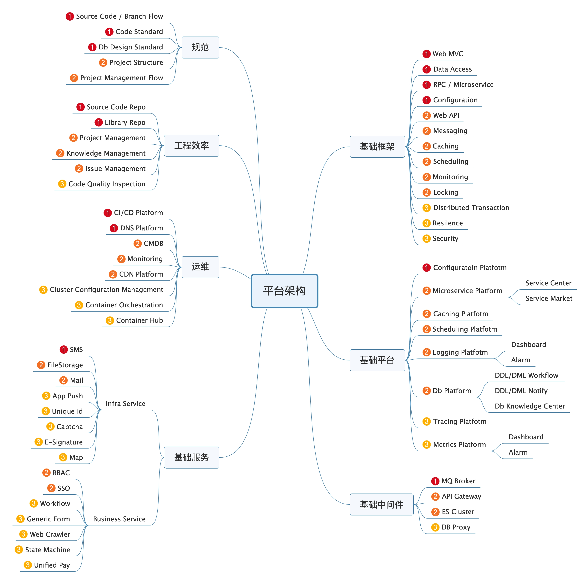

# 统一开发技术

## 前言

程序开发毕竟还不是搬砖这种无脑体力劳动，需要事先有标准，有架构，有设计，绝对不是新公司今天创立，明天就可以开始编码的。其实很多公司在起步的时候没有财力和资源建设独立的基础架构或平台架构部门，甚至运维团队都没有，但是这不妨碍我们心中有一个蓝图知道努力的方向，本文我们就简单聊聊平台架构相关的工作内容（或者说作为一个技术管理，应该去梳理、统一、明确的部分）的蓝图。由于本文覆盖的内容比较多，只能抛砖引玉大概提一些，无法一一展开太详细的东西。图中的数字是我认为的优先级，仅供参考。



## 通用entity设计

- 通常一个数据实体定义一个类

- 有时需要项目上统一使用一些固定字段，于是定义一个base类：

```java
public class BaseEntity{
    String id;
    String createBy;
    String updateBy;
    DateTime createOn;
    DateTime updateOn;
}
```

  问题来了：

- 如果不同项目需要不同的Id类型，如何实现？
- 利用泛型解决类型扩展

```java
public class BaseEntity<ID>{
    ID id;
    String createBy;
    String updateBy;
    LocalDateTime createOn;
    LocalDateTime updateOn;
}
```

如果不同实体（表）需要不同的Id策略如何实现？

利用接口解决特性扩展

```java
public interface IEntity<ID> {
    ID getId();
}
public class BaseEntity<ID> implements IEntity<ID>{
    ID id;
    String createBy;
    String updateBy;
    LocalDateTime createOn;
    LocalDateTime updateOn;
}
```

不是所有表都需要审计字段如何去除或省略？

同样的方式把审计字段抽到接口中即可

```java
public interface ISupportAudit<ID> {
    getCreateTime();

    getUpdateTime();

    ID getCreateBy();

    ID getUpdateBy();

    void setCreateTime(LocalDateTime createTime);

    void setUpdateTime(LocalDateTime updateTime);

    void setCreateBy(ID createBy);

    void setUpdateBy(ID updateBy);
}

public class BaseEntity<ID> implements IEntity<ID>，ISupportAudit<ID> {
    
    ID id;
    String createBy;
    String updateBy;
    DateTime createOn;
    DateTime updateOn;
}
```


## IOC容器

- 所有实现放到容器中

- 获取容器的方式：

```java
var iocContainer = SpringApplication.run(Application.class, args);
ApplicationContextAware.setApplicationContext(ApplicationContext applicationContext);
@Autowired
ApplicationContext iocContainer;
...
```

- 生命周期
- 

## 事件通知

## 远程调用

## 缓存与锁
