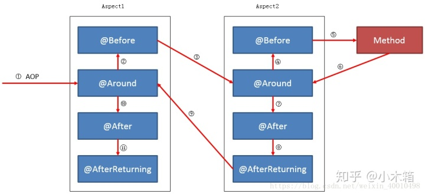

# Spring AOP

## Spring AOP 配置

spring aop中默认使用 AspectJ

# 切点
Pointcut接口有两个，分别在AspectJ和Spring中使用。主要实现ClassFilter和MethodMatcher功能。

Spring框架中常用的切点（内置大量类和方法过滤器）：

1. JdkRegexpMethodPointcut

2. AspectJExpressionPointcut

3. AnnotationMatchingPointcut

4. ComposablePointcut

## @Pointcut

此注释可以通过切点表达式定论需要切入的点（参考AspectJExpressionPointcut）：	

1. execution:匹配方法的执行
2. within:匹配包或子包中的方法
3. this:匹配实现接口的代理对象中的方法
4. target:匹配实现接口的目标对象中的方法
5. args:匹配参数格式符合标准的方法
6. bean:匹配指定的bean中所有的方法

# 通知

通知可以理解为对类或方法的增强：

1. 类 > DynamicIntroductionAdvice > IntroductionInterceptor > MethodInterceptor > Advice

2. 方法 > MethodInterceptor > Advice

## 类型

1、before:前置通知 (应用：各种校验)	在方法执行前执行，如果通知抛出异常，阻止方法运行
2、afterReturning:后置通知(应用：常规数据处理)方法正常返回后执行，如果方法中抛出异常，通知无法执行 必须在方法执行后才执行，所以可以获得方法的返回值。
3、around:环绕通知(应用：十分强大，可以做任何事情)方法执行前后分别执行，可以阻止方法的执行必须手动执行目标方法
4、afterThrowing:抛出异常通知(应用：包装异常信息)方法抛出异常后执行，如果方法没有抛出异常，无法执行
5、after:最终通知(应用：清理现场)方法执行完毕后执行，无论方法中是否出现异常

# 实现
在FactoryBean<T>中使用ProxyFactory生成T，在ProxyFactory上增加Advisor （ cutpoint + advice ）

