 

# 1    nginx介绍

## 1.1  什么是nginx

​     Nginx是一款高性能的http 服务器/反向代理服务器及电子邮件（IMAP/POP3）代理服务器。官方测试nginx能够支支撑5万并发链接，并且cpu、内存等资源消耗却非常低，运行非常稳定。

​     

# 2    nginx安装

## 2.1  下载

 

进入http://nginx.org/en/download.html 下载nginx1.8.0版本（当前最新稳定版本）。

 

 

## 2.2  安装

### 2.2.1 nginx安装环境

​     nginx是C语言开发，建议在linux上运行，本教程使用Centos6.5作为安装环境。

n gcc

​     安装nginx需要先将官网下载的源码进行编译，编译依赖gcc环境，如果没有gcc环境，需要安装gcc：yum install gcc-c++ 

n PCRE

​     PCRE(Perl Compatible Regular Expressions)是一个Perl库，包括 perl 兼容的正则表达式库。nginx的http模块使用pcre来解析正则表达式，所以需要在linux上安装pcre库。

**yum install -y pcre pcre-devel**

注：pcre-devel是使用pcre开发的一个二次开发库。nginx也需要此库。

n zlib

​     zlib库提供了很多种压缩和解压缩的方式，nginx使用zlib对http包的内容进行gzip，所以需要在linux上安装zlib库。

**yum install -y zlib zlib-devel**

 

n openssl

​     OpenSSL 是一个强大的安全套接字层密码库，囊括主要的密码算法、常用的密钥和证书封装管理功能及SSL协议，并提供丰富的应用程序供测试或其它目的使用。

​     nginx不仅支持http协议，还支持https（即在ssl协议上传输http），所以需要在linux安装openssl库。

**yum install -y openssl openssl-devel**

 

### 2.2.2 编译安装

将nginx-1.8.0.tar.gz拷贝至linux服务器。

 

解压：

tar -zxvf nginx-1.8.0.tar.gz

cd nginx-1.8.0

 

1、 configure

./configure --help查询详细参数（参考本教程附录部分：nginx编译参数）

 

参数设置如下：

./configure \

--prefix=/usr/local/nginx \

--pid-path=/var/run/nginx/nginx.pid \

--lock-path=/var/lock/nginx.lock \

--error-log-path=/var/log/nginx/error.log \

--http-log-path=/var/log/nginx/access.log \

--with-http_gzip_static_module \

--http-client-body-temp-path=/var/temp/nginx/client \

--http-proxy-temp-path=/var/temp/nginx/proxy \

--http-fastcgi-temp-path=/var/temp/nginx/fastcgi \

--http-uwsgi-temp-path=/var/temp/nginx/uwsgi \

--http-scgi-temp-path=/var/temp/nginx/scgi

 

**注意：上边将临时文件目录指定为/var/temp/nginx****，需要在/var****下创建temp****及nginx****目录**

mkdir -p /var/temp/nginx

 

2、 编译安装

make

make  install

 

安装成功查看安装目录 ：

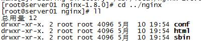

 

 

## 2.3  启动nginx

cd /usr/local/nginx/sbin/

./nginx 

 

查询nginx进程：

 

15098是nginx主进程的进程id，15099是nginx工作进程的进程id

 

**注意：执行./nginx****启动nginx****，这里可以-c****指定加载的nginx****配置文件，如下：**

**./nginx -c /usr/local/nginx/conf/nginx.conf**

**如果不指定-c****，nginx****在启动时默认加载conf/nginx.conf****文件，此文件的地址也可以在编译安装nginx****时指定./configure****的参数（--conf-path=** **指向配置文件（nginx.conf****））**

 

## 2.4  停止nginx

方式1，快速停止：

cd /usr/local/nginx/sbin

./nginx -s stop

此方式相当于先查出nginx进程id再使用kill命令强制杀掉进程。

 

方式2，完整停止(建议使用)：

cd /usr/local/nginx/sbin

./nginx -s quit

此方式停止步骤是待nginx进程处理任务完毕进行停止。

 

 

## 2.5  重启nginx

方式1，先停止再启动（建议使用）：

对nginx进行重启相当于先停止nginx再启动nginx，即先执行停止命令再执行启动命令。

如下：

./nginx -s quit

./nginx

 

方式2，重新加载配置文件：

当nginx的配置文件nginx.conf修改后，要想让配置生效需要重启nginx，使用-s reload不用先停止nginx再启动nginx即可将配置信息在nginx中生效，如下：

./nginx -s reload

 

## 2.6  安装测试

nginx安装成功，启动nginx，即可访问虚拟机上的nginx：

 

到这说明nginx基本上安装成功。

 

# 3    nginx反向代理

## 3.1  什么是反向代理

​     通常的代理服务器，只用于代理内部网络对Internet的连接请求，客户机必须指定代理服务器,并将本来要直接发送到Web服务器上的http请求发送到代理服务器中由代理服务器向Internet上的web服务器发起请求，最终达到客户机上网的目的。

​     而反向代理（Reverse Proxy）方式是指以代理服务器来接受internet上的连接请求，然后将请求转发给内部网络上的服务器，并将从服务器上得到的结果返回给internet上请求连接的客户端，此时代理服务器对外就表现为一个反向代理服务器。

 

如下图：

 

 

## 3.2  nginx+tomcat反向代理

### 3.2.1 需求

​     两个tomcat服务通过nginx反向代理，本例子使用三台虚拟机进行测试，

​     nginx服务器：192.168.101.3

​     tomcat1服务器：192.168.101.5

​     tomcat2服务器：192.168.101.6

如下图：

 

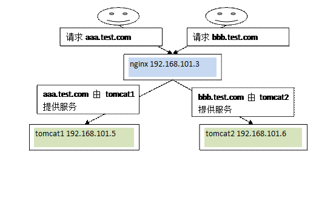

 

 

### 3.2.2 启动tomcat

​     tomcat使用apache-tomcat-7.0.57版本，在192.168.101.5和192.168.101.6虚拟机上启动tomcat。

 

### 3.2.3 nginx反向代理配置

根据上边的需求在nginx.conf文件中配置反向代理，如下：

 

\#配置一个代理即tomcat1服务器

upstream tomcat_server1 {

​      server 192.168.101.5:8080;

​    }

\#配置一个代理即tomcat2服务器

  upstream tomcat_server2 {

​      server 192.168.101.6:8080;

​    }

 

\#配置一个虚拟主机

  server {

​    listen 80;

​    server_name aaa.test.com;

​    location / {

​                   \#域名aaa.test.com的请求全部转发到tomcat_server1即tomcat1服务上

​        proxy_pass http://tomcat_server1;

​                   \#欢迎页面，按照从左到右的顺序查找页面

​        index index.jsp index.html index.htm;

​    }

 

  }

 

  server {

​    listen 80;

​    server_name bbb.test.com;

 

​    location / {

​                    \#域名bbb.test.com的请求全部转发到tomcat_server2即tomcat2服务上

​         proxy_pass http://tomcat_server2;

​         index index.jsp index.html index.htm;

​    }

  }

 

### 3.2.4 测试

分别修改两个tomcat下的webapps/ROOT/index.jsp的内容，使用tomcat1和tomcat2两个服务首页显示不同的内容，如下：

tomcat1下的index.jsp修改后：

 

tomcat2下的index.jsp修改后：

 

 

分别访问aaa.test.com、bbb.test.com测试反向代理。

 

请求访问aaa.test.com通过nginx代理访问tomcat1，请求访问bbb.test.com通过nginx代理访问tomcat2。

 

 

# 4    负载均衡

## 4.1  什么是负载均衡

​     负载均衡 建立在现有网络结构之上，它提供了一种廉价有效透明的方法扩展网络设备和服务器的带宽、增加吞吐量、加强网络数据处理能力、提高网络的灵活性和可用性。

​     负载均衡，英文名称为Load Balance，其意思就是分摊到多个操作单元上进行执行，例如Web服务器、FTP服务器、企业关键应用服务器和其它关键任务服务器等，从而共同完成工作任务。

## 4.2  nginx实现负载均衡

### 4.2.1 需求

​     nginx作为负载均衡服务器，用户请求先到达nginx，再由nginx根据负载配置将请求转发至 tomcat服务器。

​     nginx负载均衡服务器：192.168.101.3

​     tomcat1服务器：192.168.101.5

​     tomcat2服务器：192.168.101.6

 

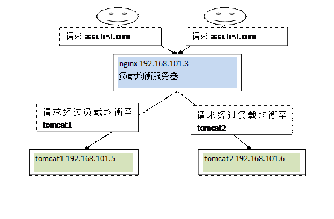

 

### 4.2.2 配置

根据上边的需求在nginx.conf文件中配置负载均衡，如下：

 

upstream tomcat_server_pool{

​    server 192.168.101.5:8080 weight=10;

​    server 192.168.101.6:8080 weight=10;

​    }

 

  server {

​    listen 80;

​    server_name aaa.test.com;

​    location / {

​         proxy_pass http://tomcat_server_pool;

​         index index.jsp index.html index.htm;

​    }

  }

 

### 4.2.3 测试

请求aaa.test.com，通过nginx负载均衡，将请求转发到tomcat服务器。

通过观察tomcat的访问日志或tomcat访问页面即可知道当前请求由哪个tomcat服务器受理。

 

 

# 5    nginx负载均衡高可用

## 5.1  什么是负载均衡高可用

​     nginx作为负载均衡器，所有请求都到了nginx，可见nginx处于非常重点的位置，如果nginx服务器宕机后端web服务将无法提供服务，影响严重。

​     为了屏蔽负载均衡服务器的宕机，需要建立一个备份机。主服务器和备份机上都运行高可用（High Availability）监控程序，通过传送诸如“I am alive”这样的信息来监控对方的运行状况。当备份机不能在一定的时间内收到这样的信息时，它就接管主服务器的服务IP并继续提供负载均衡服务；当备份管理器又从主管理器收到“I am alive”这样的信息时，它就释放服务IP地址，这样的主服务器就开始再次提供负载均衡服务。

 

 

 

## 5.2  keepalived+nginx实现主备

### 5.2.1 什么是keepalived

​     keepalived是集群管理中保证集群高可用的一个服务软件，用来防止单点故障。

​    Keepalived的作用是检测web服务器的状态，如果有一台web服务器死机，或工作出现故障，Keepalived将检测到，并将有故障的web服务器从系统中剔除，当web服务器工作正常后Keepalived自动将web服务器加入到服务器群中，这些工作全部自动完成，不需要人工干涉，需要人工做的只是修复故障的web服务器。

 

### 5.2.2 keepalived工作原理

​     keepalived是以VRRP协议为实现基础的，VRRP全称Virtual Router Redundancy Protocol，即虚拟路由冗余协议。

​     虚拟路由冗余协议，可以认为是实现路由器高可用的协议，即将N台提供相同功能的路由器组成一个路由器组，这个组里面有一个master和多个backup，master上面有一个对外提供服务的vip（该路由器所在局域网内其他机器的默认路由为该vip），master会发组播，当backup收不到VRRP包时就认为master宕掉了，这时就需要根据VRRP的优先级来选举一个backup当master。这样的话就可以保证路由器的高可用了。

​     keepalived主要有三个模块，分别是core、check和VRRP。core模块为keepalived的核心，负责主进程的启动、维护以及全局配置文件的加载和解析。check负责健康检查，包括常见的各种检查方式。VRRP模块是来实现VRRP协议的。 

 

### 5.2.3 keepalived+nginx实现主备过程

 

#### 5.2.3.1 初始状态

 

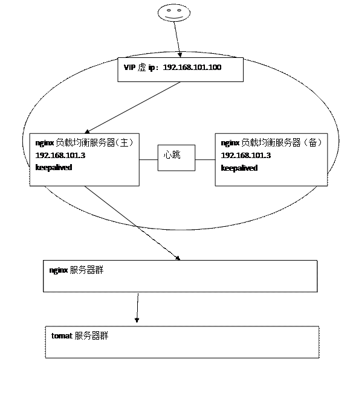

 

 

#### 5.2.3.2 主机宕机

 

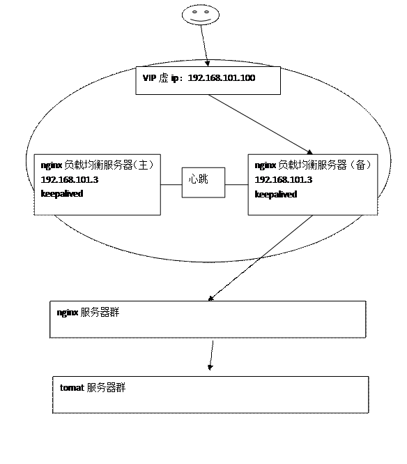

#### 5.2.3.3 主机恢复

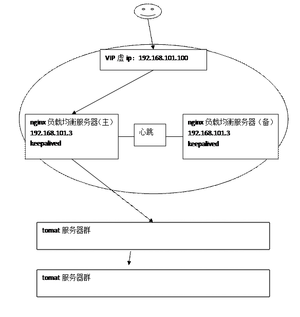

 

### 5.2.4 高可用环境

两台nginx，一主一备：192.168.101.3和192.168.101.4

两台tomcat服务器：192.168.101.5、192.168.101.6

 

 

### 5.2.5 安装keepalived

 

​     分别在主备nginx上安装keepalived

D:\讲课内容--\新巴巴运动网\nginx高并发解决\高可用\keepalived\安装包

安装命令：

查看openssl的版本：要求必须是openssl-1.0.1e以上才行、如果版本已经符合、不用再安装openssl

 （非必须）Rpm –Uvh openssl-1.0.1e-30.el6.8.i686.rpm

安装keepalived软件

rpm –ivh keepalived-1.2.13-5.el6_6.i686.rpm

 

### 5.2.6 配置keepalived

#### 5.2.6.1 主nginx

修改主nginx下/etc/keepalived/keepalived.conf文件

 

! Configuration File for keepalived

 

\#全局配置

global_defs {

  notification_email { #指定keepalived在发生切换时需要发送email到的对象，一行一个

   XXX@XXX.com

  }

  notification_email_from XXX@XXX.com #指定发件人

  \#smtp_server XXX.smtp.com               #指定smtp服务器地址

  \#smtp_connect_timeout 30                #指定smtp连接超时时间

  router_id LVS_DEVEL                  #运行keepalived机器的一个标识

}

 

vrrp_instance VI_1 { 

  state MASTER      #标示状态为MASTER 备份机为BACKUP

  interface eth0     #设置实例绑定的网卡

  virtual_router_id 51  #同一实例下virtual_router_id必须相同

  priority 100      #MASTER权重要高于BACKUP 比如BACKUP为99 

  advert_int 1      #MASTER与BACKUP负载均衡器之间同步检查的时间间隔，单位是秒

  authentication {    #设置认证

​    auth_type PASS   #主从服务器验证方式

​    auth_pass 8888

  }

  virtual_ipaddress {  #设置vip

​    192.168.101.100    #可以多个虚拟IP，换行即可

  }

}

 

 

#### 5.2.6.2 备nginx

修改备nginx下/etc/keepalived/keepalived.conf文件

**配置备nginx****时需要注意：需要修改state****为BACKUP , priority****比MASTER****低，virtual_router_id****和master****的值一致**

 

! Configuration File for keepalived

 

\#全局配置

global_defs {

  notification_email { #指定keepalived在发生切换时需要发送email到的对象，一行一个

  XXX@XXX.com

  }

  notification_email_from XXX@XXX.com                   #指定发件人

  \#smtp_server XXX.smtp.com                #指定smtp服务器地址

  \#smtp_connect_timeout 30                #指定smtp连接超时时间

  router_id LVS_DEVEL                  #运行keepalived机器的一个标识

}

 

vrrp_instance VI_1 { 

  state BACKUP      #标示状态为MASTER 备份机为BACKUP

  interface eth0     #设置实例绑定的网卡

   virtual_router_id 51  #同一实例下virtual_router_id必须相同

  priority 99      #MASTER权重要高于BACKUP 比如BACKUP为99 

  advert_int 1      #MASTER与BACKUP负载均衡器之间同步检查的时间间隔，单位是秒

  authentication {    #设置认证

​     auth_type PASS   #主从服务器验证方式

​    auth_pass 8888

  }

  virtual_ipaddress {  #设置vip

​    192.168.101.100    #可以多个虚拟IP，换行即可

  }

}

 

### 5.2.7 测试

主备nginx都启动keepalived及nginx。

service keepalived start

./nginx 

 

#### 5.2.7.1 初始状态

查看主nginx的eth0设置：

vip绑定在主nginx的eth0上。

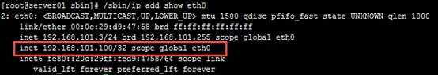

 

查看备nginx的eth0设置：

vip没有绑定在备nginx的eth0上。

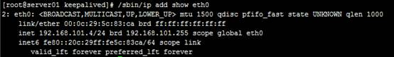

 

访问ccc.test.com，可以访问。

 

#### 5.2.7.2 主机宕机

将主nginx的keepalived停止或将主nginx关机(相当于模拟宕机)，查看主nginx的eth0：

eth0没有绑定vip

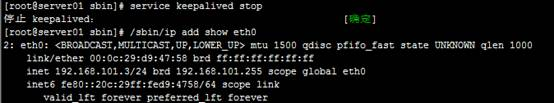

注意这里模拟的是停止 keepalived进程没有模拟宕机，所以还要将nginx进程也停止表示主nginx服务无法提供。

 

查看备nginx的eth0：

vip已经漂移到备nginx。

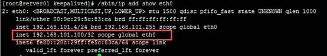

 

访问ccc.test.com，可以访问。

 

#### 5.2.7.3 主机恢复

将主nginx的keepalived和nginx都启动。

查看主nginx的eth0：

 

查看备nginx的eth0：

vip漂移到主nginx。

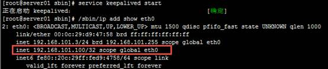

 

查看备nginx的eth0：

eth0没有绑定vip

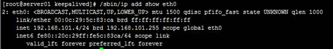

 

 

访问：ccc.test.com，正常访问。

**注意：主nginx****恢复时一定要将nginx****也启动（通常nginx****启动要加在开机启动中），否则即使vip****漂移到主nginx****也无法访问。**

 

### 5.2.8 解决nginx进程和keepalived不同时存在问题

#### 5.2.8.1 问题描述

​     keepalived是通过检测keepalived进程是否存在判断服务器是否宕机，如果keepalived进程在但是nginx进程不在了那么keepalived是不会做主备切换，所以我们需要写个脚本来监控nginx进程是否存在，如果nginx不存在就将keepalived进程杀掉。

 

#### 5.2.8.2 nginx进程检测脚本

​     在主nginx上需要编写nginx进程检测脚本（check_nginx.sh），判断nginx进程是否存在，如果nginx不存在就将keepalived进程杀掉，check_nginx.sh内容如下：

 

\#!/bin/bash

\# 如果进程中没有nginx则将keepalived进程kill掉

A=`ps -C nginx --no-header |wc -l`   ## 查看是否有 nginx进程 把值赋给变量A 

if [ $A -eq 0 ];then          ## 如果没有进程值得为 零

​    service keepalived stop     ## 则结束 keepalived 进程

fi

 

将check_nginx.sh拷贝至/etc/keepalived下，

脚本测试：

将nginx停止，将keepalived启动，执行脚本：sh /etc/keepalived/check_nginx.sh

 

从执行可以看出自动将keepalived进程kill掉了。

 

#### 5.2.8.3 修改keepalived.conf

修改主nginx的keepalived.conf，添加脚本定义检测：

注意下边红色标识地方：

 

\#全局配置

global_defs {

  notification_email { #指定keepalived在发生切换时需要发送email到的对象，一行一个

   XXX@XXX.com

  }

  notification_email_from miaoruntu@itcast.cn #指定发件人

  \#smtp_server XXX.smtp.com               #指定smtp服务器地址

  \#smtp_connect_timeout 30                #指定smtp连接超时时间

  router_id LVS_DEVEL                  #运行keepalived机器的一个标识

}

vrrp_script check_nginx {

  script "/etc/keepalived/check_nginx.sh"     ##监控脚本

  interval 2                   ##时间间隔，2秒

  weight 2                    ##权重

}

vrrp_instance VI_1 {

  state MASTER      #标示状态为MASTER 备份机为BACKUP

  interface eth0     #设置实例绑定的网卡

  virtual_router_id 51  #同一实例下virtual_router_id必须相同

  priority 100      #MASTER权重要高于BACKUP 比如BACKUP为99

  advert_int 1      #MASTER与BACKUP负载均衡器之间同步检查的时间间隔，单位是秒

  authentication {    #设置认证

​    auth_type PASS   #主从服务器验证方式

​    auth_pass 8888

  }

  track_script {

​    check_nginx    #监控脚本

  }

  virtual_ipaddress {  #设置vip

​    192.168.101.100    #可以多个虚拟IP，换行即可

  }

 

}

 

修改后重启keepalived

 

#### 5.2.8.4 测试

回到负载均衡高可用的初始状态，保证主、备上的keepalived、nginx全部启动。

停止主nginx服务

 

观察keepalived日志：

tail -f /var/log/message

查看keepalived进程已经不存在。

查看eth0已经没有绑定vip。

 

 